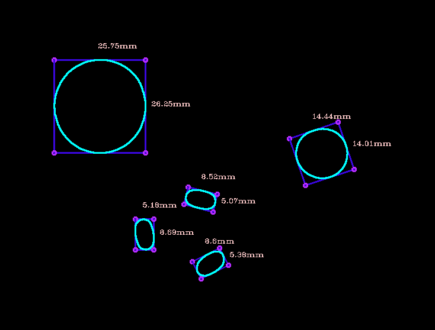
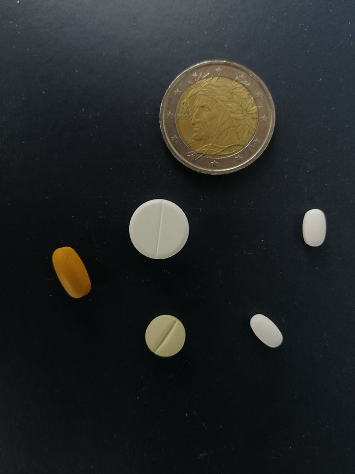
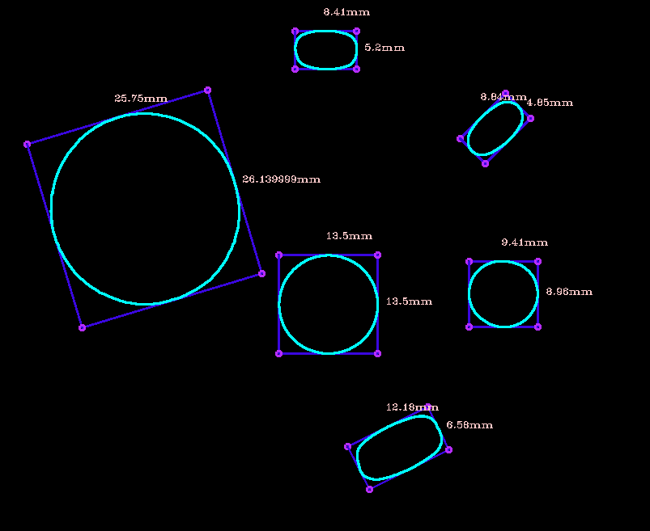
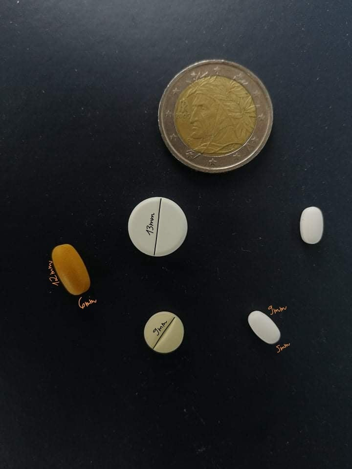

# Computer-Vision-Object-Size-Measuring

## Computer Vision Program to Measure the Width and Height of objects on the picture

Requirements: Build and Install OpenCV

The system works by placing a reference object of known size on to the image.
Note that the reference object should be the left most object on the image.
We use the object to calculate a pixels per metric constant [pixels/mm],
the constant is later used to calculate width and height of objects on the image.
Measuring the number of pixels between two vertices and dividing by
pixels per metric gives us the real world distance between vertices in millimeters.

Note that the precision of the measurement is strongly influenced, by the angle of
camera. The angle at which we take a photo must be as close to 90deg to the xy plane
as possible. Factors such as lens distortion also impact the result. The system was build for education purposes, 
so its not fully scalable nor build for performance. The system may produce incorrect results given a picture 
with completely different light conditions, since the amount of preprocessing is specific to the image.
  
## Test Results:
    I tested it with two pictures with different lighting conditions, here are the
    results:
 
Input Image1

Labeled Image1

Input Image2
 

Labeled Image2

 
Actual Measurments done by hand

  
    
